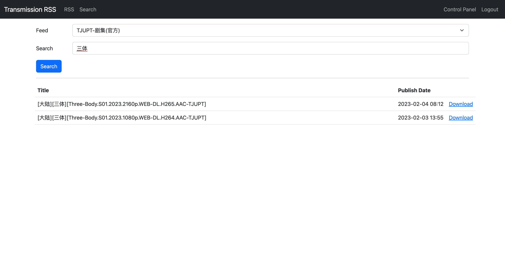

# A Transmission RSS Manager

[](https://hub.docker.com/r/hpdell/transmission-rss-django/)
[](https://hub.docker.com/r/hpdell/transmission-rss-django/)

[中文说明](README.zh-CN.md)

Powered by Django.

## Features

Torrent list and feed list.


Manage mathcers for each feed (regular expression is supported).


Search feed by keywrods.



## Deployment

### Docker (Recommended)

Pull image [hpdell/transmission-rss-django](https://hub.docker.com/r/hpdell/transmission-rss-django/) and run with the following configure for example:

```bash
docker run -d
    --env TRANSRSS_HOST=your.host                       # Host of this RSS manager site
    --env TRANSMISSION_HOST=your.transmission.host      # Host of your Transmission
    --env TRANSMISSION_PORT=9091                        # Port of your Transmission
    --env TRANSMISSION_USERNAME=admin                   # Username to login Transmission
    --env TRANSMISSION_PASSWORD=transmission_password   # Password to login Transmission
    --env DJANGO_SUPERUSER_USERNAME=admin               # Django superuser's name
    --env DJANGO_SUPERUSER_PASSWORD=django_password     # Django superuser's password
    --env DJANGO_SUPERUSER_EMAIL=email@example.com      # Django superuser's email
    --env SUBSCRIBER_INVERVAL=600                       # RSS update interval
    --env SUBSCRIBER_MODE=ON                            # [Optional] set off to stop auto-refresh RSS feeds
    -p 9092:9092
    -v $(pwd):/code/db
    hpdell/transmission-rss-django
```

### Run with Python

Clone this reposity and run

```bash
pip install -r requirements.txt
./startup.sh
```

## Torrent Refresh

### Automatically Refresh

When this app starts, a subscriber will also start to subscribe RSS feeds.
Every `SUBSCRIBER_INVERVAL` seconds the subscriber will try to fetch all published torrents and add them to Django's database.
It will also remove torrents which is no longer feeded.
When all feeds are updated, it will let Django compare each torrent with matchers belonging to the same feed source.
Once successfully matched, the torrent will be added to Transmission.

### Manually Refresh

By clicking the button to the right of title "Torrents" on the Home page, server will triger the automatically refreshing process once.
Usually this button is used after when users add a new feed or matcher.

## Authentication

When starting up, this app will automatically create a superuser with name `DJANGO_SUPERUSER_USERNAME` and password `DJANGO_SUPERUSER_PASSWORD` passed from environment variables.
The supersuer can create other users in Django's administration site at path `/admin/`.

Note that the [RSS subscriber script](transrss_manager/subscriber.py) starts as a process and uses superuser's credential to communicate with the Django backend.
