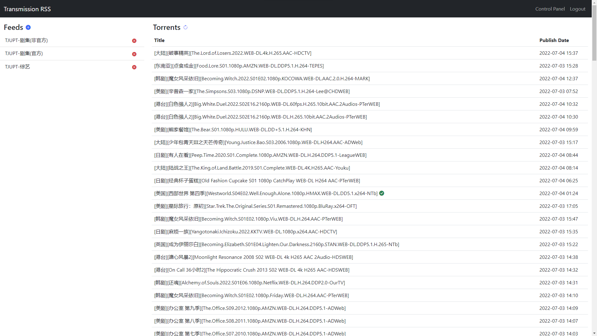
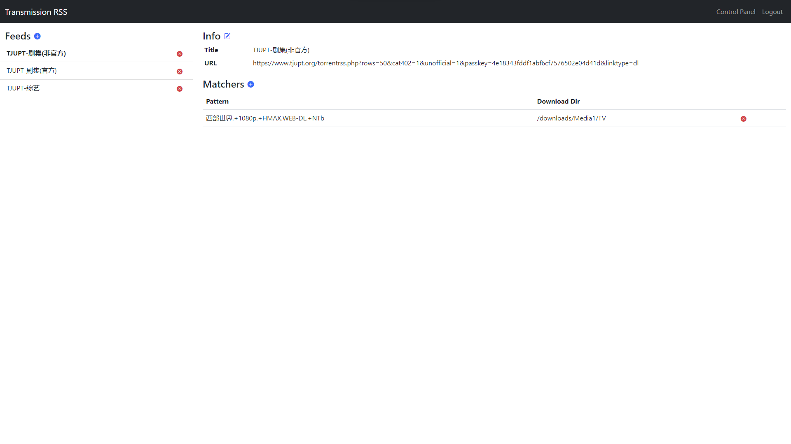

# Transmission RSS 管理平台

[](https://hub.docker.com/r/hpdell/transmission-rss-django/)
[](https://hub.docker.com/r/hpdell/transmission-rss-django/)

[English](README.md)

基于 Django 构建。

## 特性

种子列表和源列表。



为每个源管理匹配器（支持正则表达式）。



根据关键词搜索源。


## Deployment

### Docker (推荐方法)

拉取镜像 [hpdell/transmission-rss-django](https://hub.docker.com/r/hpdell/transmission-rss-django/) 并使用如下示例的命令运行：

```bash
docker run -d
    --env TRANSRSS_HOST=your.host                       # 该管理平台的域名
    --env TRANSMISSION_HOST=your.transmission.host      # Transmission 域名
    --env TRANSMISSION_PORT=9091                        # Transmission 端口
    --env TRANSMISSION_USERNAME=admin                   # Transmission 登录用户名
    --env TRANSMISSION_PASSWORD=transmission_password   # Transmission 登录密码
    --env DJANGO_SUPERUSER_USERNAME=admin               # Django 超级用户的用户名
    --env DJANGO_SUPERUSER_PASSWORD=django_password     # Django 超级用户的密码
    --env DJANGO_SUPERUSER_EMAIL=email@example.com      # Django 超级用户的邮箱
    --env SUBSCRIBER_INVERVAL=600                       # RSS 更新间隔
    --env SUBSCRIBER_MODE=ON                            # [可选] 设置为 OFF 以阻止自动刷新 RSS
    -p 9092:9092
    -v $(pwd):/code/db
    hpdell/transmission-rss-django
```

### 使用 Python 运行

克隆本仓库并执行如下命令

```bash
pip install -r requirements.txt
./startup.sh
```

## 刷新种子

### 自动刷新

当管理平台启动时，一个订阅器也会同时启动以订阅 RSS 源。
每隔 `SUBSCRIBER_INVERVAL` 指定的秒数后，订阅器就会尝试获取所有发布的种子并添加到 Django 数据库中，同时移除所有不再发布的种子。
当所有 RSS 源都被更新后，订阅器会让 Django 对每一个种子用添加在同一个 RSS 源中的所有匹配器进行匹配，一旦匹配成功就添加到 Transmission 中。

### 手动刷新

通过点击或单击首页“Torrent”标题右边的按钮，服务器会触发一次自动种子刷新的流程。
通常这个按钮在用户添加了新的 RSS 源或匹配器后使用。

## 身份认证

当应用启动的时候，会自动根据环境变量中的 `DJANGO_SUPERUSER_USERNAME` 和 `DJANGO_SUPERUSER_PASSWORD` 创建一个超级用户。
可以使用该超级用户账号在 Django 的管理页面（地址是 `/admin/`）创建其他的用户。

注意：[RSS 订阅器脚本](transrss_manager/subscriber.py) 是作为进程启动的，并且使用超级用户的凭据和 Django 进行交互。
